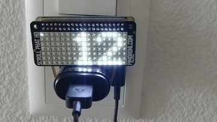

# Raspberry Pi Stationboard



Shows next departures for multiple stations of Zurich Public Transport (VBZ), in real time.
Needs a [ScrollPhat HD](https://shop.pimoroni.com/products/scroll-phat-hd?variant=2380803768330).
Uses the Search.ch public transport API.

Tested on a Raspberry Pi Zero W.

## Setup

```bash
# on raspi
sudo hostnamectl set-hostname stationboard-pi
curl https://get.pimoroni.com/scrollphathd | bash

# deploy
scp raspi_stationboard.py pi@192.168.0.102:stationboard

crontab -e
# @reboot /home/pi/stationboard/raspi_stationboard.py
```

### Avahi

`/etc/avahi/services/ssh.service`:

```
<?xml version="1.0" standalone='no'?><!--*-nxml-*-->
<!DOCTYPE service-group SYSTEM "avahi-service.dtd">
<service-group>
  <name replace-wildcards="yes">SSH on %h</name>
  <service protocol="any">
    <type>_ssh._tcp</type>
    <port>22</port>
  </service>
</service-group>
```
